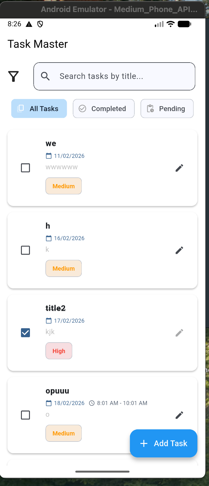
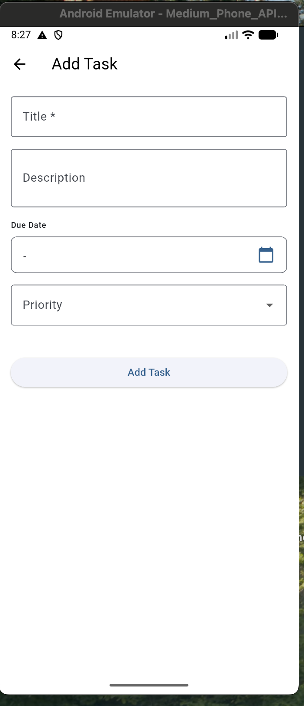
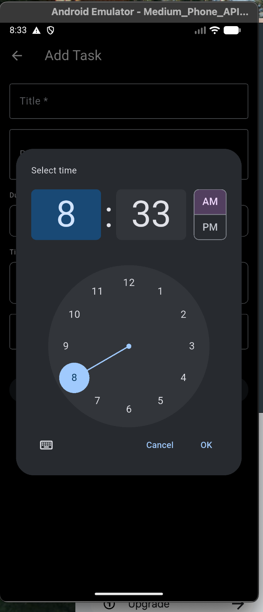
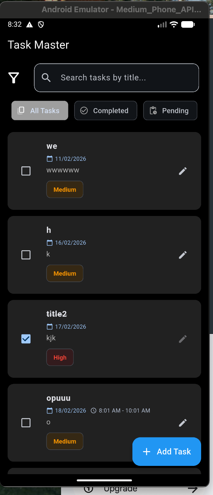
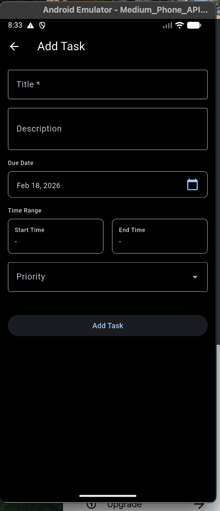

# 📋 Task Manager - Clean Architecture Flutter App

<div align="center">

A powerful, feature-rich task management application built with **Flutter**, **Clean Architecture**, **BLoC**, and **Hive**. Efficiently manage your tasks with scheduling, priority levels, and persistent local storage.

[](https://flutter.dev)
[](https://dart.dev)
[](LICENSE)

[Download](#-getting-started) • [Architecture](#-architecture) • [Features](#-features) • [Setup](#-setup)

</div>

---

## ✨ Features

### Core Features
- ✅ **Create, Read, Update, Delete** - Full CRUD operations for tasks
- 📅 **Calendar Date Picker** - Easily select due dates with a bordered calendar interface
- ⏰ **Time Range Scheduling** - Set start and end times for tasks (e.g., 9:00 AM - 5:00 PM)
- 🎯 **Priority Levels** - Categorize tasks as Low, Medium, or High priority
- ☑️ **Task Completion** - Mark tasks as complete/incomplete with smooth animations
- 🔍 **Search & Filter** - Find tasks by title and filter by status (All, Completed, Pending)
- 🔄 **Real-time Sorting** - Sort tasks by due date or priority
- 💾 **Persistent Storage** - All data saved locally with Hive database

### Advanced Features
- 🌙 **Dark Mode** - Automatic light/dark theme based on system settings
- 🎨 **Material Design 3** - Modern, responsive UI with smooth animations
- 🗑️ **Swipe to Delete** - Dismiss cards with undo functionality
- 📱 **Responsive Design** - Works seamlessly on phones and tablets
- ⚡ **Fast Performance** - Optimized with BLoC state management
- 📊 **Task Duration Display** - Shows how long each task will take
- 🎭 **Smooth Animations** - Checkbox transitions, card animations, and fades

---
## 📸 Screenshots

<div align="center">











</div>

### Light Mode
```
┌─────────────────┐
│ Task Master     │  
├─────────────────┤
│ 🔍 Search...    │
├─────────────────┤
│ All | Complete |│
├─────────────────┤
│ ☑ Task Title    │
│   📅 18/02/2026 │
│   ⏰ 9:00-5:00  │
│   🏷 Medium     │
├─────────────────┤
│      + Add      │
└─────────────────┘
```

### Dark Mode
Same layout with dark colors (automatically enabled based on system theme)

---

## 🏗️ Architecture

This project follows **Clean Architecture** principles with 3 distinct layers:

```
┌─────────────────────────────────────────────────────────┐
│                  PRESENTATION LAYER                      │
│  (Screens, Widgets, BLoC State Management)              │
│  ├── screens/          (TaskListScreen, AddEditScreen)  │
│  ├── cubit/            (TaskCubit, TaskState)           │
│  └── widgets/          (TaskItemWidget, Pickers, etc)   │
└──────────────────┬──────────────────────────────────────┘
                   │ (Uses)
┌──────────────────▼──────────────────────────────────────┐
│                   DOMAIN LAYER                           │
│  (Business Logic, Independent of Frameworks)            │
│  ├── entities/        (TaskEntity)                       │
│  ├── repositories/    (Abstract interfaces)             │
│  ├── usecases/        (Create, Update, Delete, etc)    │
│  └── enums/           (TaskFilter, TaskPriority)       │
└──────────────────┬──────────────────────────────────────┘
                   │ (Implements)
┌──────────────────▼──────────────────────────────────────┐
│                    DATA LAYER                            │
│  (Database, API calls, Data models)                      │
│  ├── datasources/     (Hive operations)                 │
│  ├── models/          (TaskModel with adapters)        │
│  └── repositories/    (Repository implementations)      │
└─────────────────────────────────────────────────────────┘
```

### Why Clean Architecture?
- ✅ **Testable** - Each layer can be tested independently
- ✅ **Maintainable** - Clear separation of concerns
- ✅ **Scalable** - Easy to add new features
- ✅ **Flexible** - Easy to swap implementations (e.g., SQLite for Hive)

---

## 📂 Project Structure

```
lib/
├── core/
│   ├── theme/
│   │   └── app_theme.dart          # Light & Dark themes
│   └── constants/
│       └── app_constants.dart       # App-wide constants
│
├── features/task_management/
│   ├── data/
│   │   ├── datasources/
│   │   │   ├── task_local_datasource.dart       # Abstract
│   │   │   └── task_local_datasource_impl.dart  # Implementation
│   │   ├── models/
│   │   │   └── task_model.dart     # Data model with Hive adapter
│   │   └── repositories/
│   │       └── task_repository_impl.dart        # Repository impl
│   │
│   ├── domain/
│   │   ├── entities/
│   │   │   └── task_entity.dart    # Pure entity
│   │   ├── repositories/
│   │   │   └── task_repository.dart        # Abstract interface
│   │   ├── usecases/
│   │   │   ├── create_task.dart
│   │   │   ├── update_task.dart
│   │   │   ├── delete_task.dart
│   │   │   ├── get_all_tasks.dart
│   │   │   └── toggle_task_completion.dart
│   │   └── enums/
│   │       ├── task_priority.dart
│   │       └── task_filter.dart
│   │
│   └── presentation/
│       ├── cubit/
│       │   ├── task_cubit.dart     # State management
│       │   └── task_state.dart     # State definitions
│       ├── screens/
│       │   ├── task_list_screen.dart      # Main list screen
│       │   └── add_edit_task_screen.dart  # Add/Edit screen
│       ├── widgets/
│       │   ├── task_item_widget.dart
│       │   ├── calendar_date_picker.dart
│       │   ├── time_range_picker.dart
│       │   ├── priority_chip_widget.dart
│       │   ├── filter_chips_widget.dart
│       │   └── empty_state_widget.dart
│       └── helpers/
│           └── task_filter_helper.dart    # Filtering logic
│
├── injection_container.dart        # Dependency injection (GetIt)
└── main.dart                        # App entry point
```

---

## 🚀 Getting Started

### Prerequisites
- **Flutter** >= 3.0.0
- **Dart** >= 2.19.0
- **Android SDK** (for Android) or **Xcode** (for iOS)

### Installation

1. **Clone the repository**
   ```bash
   git clone <repository-url>
   cd task_manager
   ```

2. **Install dependencies**
   ```bash
   flutter pub get
   ```

3. **Generate code** (for Hive adapters and build_runner)
   ```bash
   flutter pub run build_runner build
   ```

4. **Run the application**
   ```bash
   flutter run
   ```

---

## 💻 Usage

### Create a Task
1. Tap the blue **+ Add Task** button
2. Enter task title (required)
3. Add description (optional)
4. Select due date using calendar picker
5. If date is selected, time range picker appears - select start and end times
6. Choose priority level
7. Tap **Add Task** to save

### Edit a Task
1. Tap the **edit** icon on any task card
2. Modify any fields
3. Tap **Save Changes**

### Delete a Task
1. Swipe the task card to the **left**
2. Delete icon appears
3. Confirm deletion
4. Can undo within the snackbar

### Search & Filter
- **Search**: Type in the search box to find tasks by title
- **Filter**: Use chips (All, Completed, Pending) to filter tasks
- **Sort**: Use the filter icon to sort by date or priority

### Complete a Task
- Tap the **checkbox** on any task to mark as complete/incomplete
- Completed tasks show strikethrough text

---

## 🛠️ Technical Details

### State Management (BLoC)
```dart
// Get all tasks
context.read<TaskCubit>().loadTasks();

// Create new task
context.read<TaskCubit>().createTask(task);

// Update existing task
context.read<TaskCubit>().modifyTask(task);

// Delete task
context.read<TaskCubit>().removeTask(taskId);

// Toggle completion
context.read<TaskCubit>().toggleCompletion(task);

// Change filter
context.read<TaskCubit>().changeFilter(TaskFilter.completed);
```

### Database Schema (Hive)
```dart
@HiveType(typeId: 0)
class TaskModel {
  @HiveField(0) final String id;
  @HiveField(1) final String title;
  @HiveField(2) final String? description;
  @HiveField(3) final DateTime? dueDate;
  @HiveField(4) final int priority;
  @HiveField(5) final bool isCompleted;
  @HiveField(6) final DateTime createdAt;
  @HiveField(7) final DateTime updatedAt;
  @HiveField(8) final int? startTimeHour;
  @HiveField(9) final int? startTimeMinute;
  @HiveField(10) final int? endTimeHour;
  @HiveField(11) final int? endTimeMinute;
}
```

### Key Dependencies
| Package | Version | Purpose |
|---------|---------|---------|
| `flutter_bloc` | ^8.0.0 | State management |
| `hive_flutter` | ^1.1.0 | Local database |
| `get_it` | ^7.0.0 | Service locator/DI |
| `intl` | ^0.18.0 | Date/time formatting |
| `uuid` | ^3.0.0 | Unique ID generation |
| `equatable` | ^2.0.0 | Value equality |

---

## 🎨 Customization

### Change Theme Colors
Edit `lib/core/theme/app_theme.dart`:
```dart
static final lightTheme = ThemeData(
  colorScheme: ColorScheme.fromSeed(
    seedColor: Colors.blue,  // Change this color
  ),
  // ... other configs
);
```

### Change Priority Levels
Edit `lib/features/task_management/domain/enums/task_priority.dart`

### Customize Animations
Edit individual widget files to adjust animation durations and effects

---

## 🔧 Development

### Running Tests
```bash
flutter test
```

### Code Generation
```bash
# Generate Hive adapters and build_runner files
flutter pub run build_runner build --delete-conflicting-outputs

# Watch for changes
flutter pub run build_runner watch
```

### Code Analysis
```bash
flutter analyze
```

### Building for Release

**Android:**
```bash
flutter build apk --release
# or
flutter build appbundle --release
```

**iOS:**
```bash
flutter build ios --release
```

---

## 📋 Git Workflow

### Only commit source code, NOT build artifacts:

✅ **Commit these:**
- `lib/` - Your Dart code
- `pubspec.yaml` - Dependencies manifest
- `android/app/src/` - Android source
- `ios/Runner/` - iOS source
- `README.md` - Documentation
- `.gitignore` - Git ignore rules

❌ **DO NOT commit:**
- `build/` - Build artifacts
- `.dart_tool/` - Generated files
- `android/build/` - Gradle output
- `.idea/` - IDE settings
- `pubspec.lock` - For apps (not packages)

See `.gitignore` for full exclusion list.

---

## 🎯 Architecture Decisions & Trade-offs

### 1. Clean Architecture
**Benefit:** Testable, maintainable, scalable  
**Trade-off:** More files and boilerplate  
**Why:** Long-term maintainability and team scalability

### 2. BLoC over Provider/GetX
**Benefit:** Predictable, testable, industry standard  
**Trade-off:** More code than lighter alternatives  
**Why:** Large community, excellent documentation

### 3. Hive over SQLite/Firebase
**Benefit:** Fast, no setup, type-safe, offline-first  
**Trade-off:** Smaller ecosystem, single-device only  
**Why:** Perfect for personal task manager with local storage

### 4. GetIt for Dependency Injection
**Benefit:** Simple, lightweight, explicit dependencies  
**Trade-off:** Service locator pattern (some don't prefer)  
**Why:** Easy to test, clear dependency graph

### 5. Material Design 3
**Benefit:** Modern, consistent, accessible  
**Trade-off:** Limited customization compared to custom UI  
**Why:** Best practices, familiar to users, reduces design burden


### Build issues
```bash
flutter clean
flutter pub get
flutter pub run build_runner build --delete-conflicting-outputs
```

### Hive adapter errors
```bash
# Regenerate Hive adapters
flutter pub run build_runner build
```

### Time format issues
- Check device locale settings
- Verify `intl` package is up to date

### Hot reload not working
```bash
flutter clean && flutter run
```

---

## 🤝 Contributing

1. **Fork the repository**
2. **Create a feature branch** (`git checkout -b feature/amazing-feature`)
3. **Commit your changes** (`git commit -m 'Add amazing feature'`)
4. **Push to the branch** (`git push origin feature/amazing-feature`)
5. **Open a Pull Request**

### Code Style Guidelines
- Follow [Dart style guide](https://dart.dev/guides/language/effective-dart/style)
- Use meaningful variable names
- Add comments for complex logic
- Run `flutter analyze` before committing

---

## 📄 License

This project is licensed under the **MIT License** - see the [LICENSE](LICENSE) file for details.

---

## 👨‍💻 Author

Created with ❤️ for efficient task management.

---

## 🙏 Acknowledgments

- **Flutter Team** - Amazing framework
- **BLoC Community** - Excellent state management pattern
- **Material Design** - Beautiful design system
- All contributors and users

---

## 📞 Support

Have questions or found a bug? Please:
1. Check existing [Issues](../../issues)
2. Create a new [Issue](../../issues/new)
3. Include:
   - Device/OS info
   - Flutter version (`flutter --version`)
   - Error message and logs
   - Steps to reproduce

---

<div align="center">

⭐ **If you like this project, please give it a star!** ⭐

**Last Updated:** February 2026  
**Version:** 1.0.0

</div>